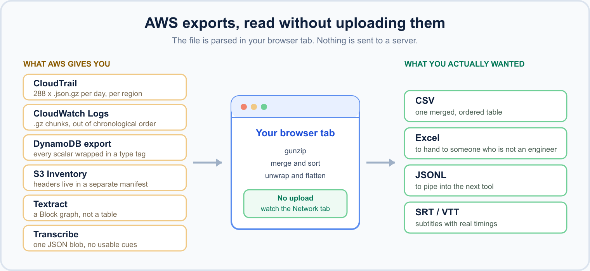
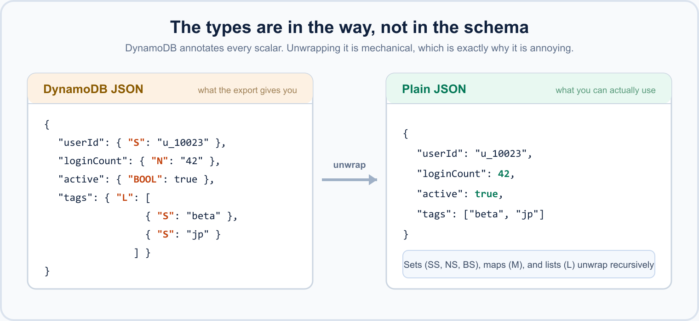
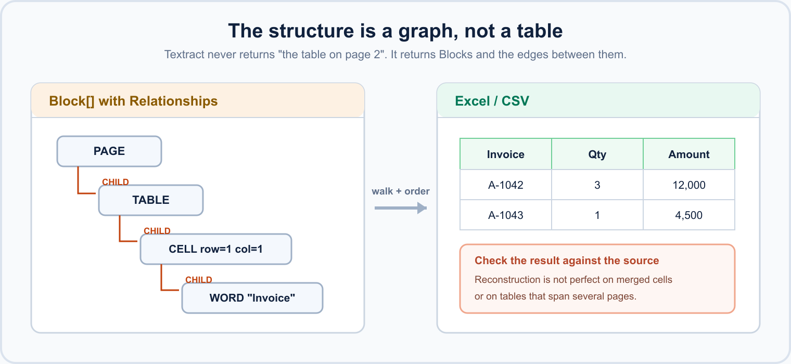

> Follow-up to "I wanted to peek at AWS Parquet files as CSV in the browser, so I built a tool".
> That one was about Parquet. This one is about everything *else* AWS hands you.
> Publish checklist is at the bottom.

## TL;DR

AWS services export their data in formats that are technically JSON but practically unreadable: gzipped, split across dozens of files, deeply nested, or wrapped in a type-annotated envelope. Every time I needed to *look* at one, I ended up writing the same throwaway script.

So I built browser-only converters for the ones I hit most. No upload — the file is parsed in your tab:

| AWS export | What you get | Tool |
|---|---|---|
| CloudTrail audit logs | dozens of `.json.gz`, one JSON array each | [CloudTrail Log to CSV](https://ai-image-tools.com/en/tools/cloudtrail-log-to-csv) |
| CloudWatch Logs to S3 | `.gz` chunks, out of order | [CloudWatch Logs Converter](https://ai-image-tools.com/en/tools/cloudwatch-logs-converter) |
| DynamoDB export / `scan` | type-annotated JSON (`{"S": "..."}`) | [DynamoDB JSON Converter](https://ai-image-tools.com/en/tools/dynamodb-json-converter) |
| S3 Inventory | `manifest.json` plus `CSV.GZ`/Parquet shards | [S3 Inventory Viewer](https://ai-image-tools.com/en/tools/s3-inventory-viewer) |
| Textract | a `Block[]` graph, no tables | [Textract JSON to Excel](https://ai-image-tools.com/en/tools/textract-json-to-excel) |
| Transcribe | one JSON blob, no cues you can use | [Transcribe JSON to SRT](https://ai-image-tools.com/en/tools/transcribe-json-to-srt) |


*The six exports, what the browser does with them, and what comes out.*

Sharing in case you keep rewriting the same script too.

## The actual problem: "JSON" is doing a lot of work in that sentence

Every one of these is valid JSON. None of them is *readable* JSON. Four separate things get in the way, and each service picks a different combination.

### 1. It is gzipped, and it is not one file

CloudTrail does not give you a log. It gives you a directory tree:

```
AWSLogs/123456789012/CloudTrail/ap-northeast-1/2026/08/19/
  123456789012_CloudTrail_ap-northeast-1_20260819T0000Z_a1b2c3.json.gz
  123456789012_CloudTrail_ap-northeast-1_20260819T0005Z_d4e5f6.json.gz
  ... x 288 per day per region
```

Each file is `{"Records": [...]}`. To answer "who deleted that bucket," you have to decompress all of them, concatenate the `Records` arrays, and *then* start looking. CloudWatch Logs exports to S3 have the same shape with a different wrinkle: the chunks are not in chronological order, so concatenating them naively gives you interleaved output that is hard to read.

### 2. The types are in the way, not in the schema

DynamoDB's export format annotates every scalar:

```json
{
  "userId":     { "S": "u_10023" },
  "loginCount": { "N": "42" },
  "active":     { "BOOL": true },
  "tags":       { "L": [ { "S": "beta" }, { "S": "jp" } ] }
}
```

That is DynamoDB JSON. What you usually want is:

```json
{ "userId": "u_10023", "loginCount": 42, "active": true, "tags": ["beta", "jp"] }
```


*Sets (SS, NS, BS), maps (M), and lists (L) unwrap recursively.*

The unwrapping is mechanical, which is exactly why it is annoying: ten minutes of work that produces nothing reusable, and you do it again next month.

### 3. The structure is a graph, not a table

Textract is the sharpest example. It does not return "the table on page 2." It returns a flat list of `Block` objects with relationship edges:

```
Block(PAGE) --CHILD--> Block(TABLE)
                         +--CHILD--> Block(CELL, row=1, col=1)
                                       +--CHILD--> Block(WORD, "Invoice")
```


*Each edge is a `CHILD` relationship. The table only exists once you walk them and sort by row and column.*

To reconstruct one spreadsheet cell you walk `Relationships[].Ids` from `TABLE` to `CELL` to `WORD`, then order by `RowIndex`/`ColumnIndex`, then join the words with the geometry in mind. The data is all there. Turning it back into the table a human saw in the PDF is a real piece of code.

### 4. The manifest is the map, and it is a separate file

S3 Inventory hands you a `manifest.json` that points at the data shards:

```json
{
  "sourceBucket": "my-bucket",
  "fileFormat": "CSV",
  "fileSchema": "Bucket, Key, Size, LastModifiedDate, StorageClass",
  "files": [
    { "key": "inventory/data/8f2c....csv.gz", "size": 4718592 },
    { "key": "inventory/data/b91a....csv.gz", "size": 4382003 }
  ]
}
```

The shards have **no header row** — the column names live only in `fileSchema` in the manifest. Open a shard on its own and you get unlabeled columns. You need both files, in the right order, to get a usable table.

## Why I stopped writing the script each time

The obvious answer is `aws s3 cp --recursive` plus a Python file. That is fine, and for anything recurring it is the correct answer. But a large share of these moments are:

- someone asks "did anyone touch that IAM role last Tuesday?"
- you are checking whether a pipeline emitted what you expected
- you need to hand a non-engineer something they can open in Excel

For those, the setup cost dominates the actual task. And there is a second constraint that matters more than convenience: **CloudTrail logs and DynamoDB exports are production data.** Pasting them into a random online JSON formatter is the kind of thing that turns into an incident report. Most "free online converter" sites upload your file to their server.

So these tools do the parsing in the browser tab. The file is read with `FileReader`, decompressed and transformed in JS, and the result is offered as a download. Nothing is sent anywhere — you can watch the Network tab while you use them.

## What each one does

**[CloudTrail Log to CSV](https://ai-image-tools.com/en/tools/cloudtrail-log-to-csv)** — drop in the whole set of `.json.gz` files. It decompresses, merges every `Records` array, flattens the fields you actually filter on (`eventTime`, `eventName`, `userIdentity.arn`, `sourceIPAddress`, `errorCode`), and gives you one CSV or JSONL.

**[CloudWatch Logs Converter](https://ai-image-tools.com/en/tools/cloudwatch-logs-converter)** — the same idea for S3-exported log groups, and it sorts by timestamp across chunk boundaries so the merged output reads in order.

**[DynamoDB JSON Converter](https://ai-image-tools.com/en/tools/dynamodb-json-converter)** — unwraps the type annotations recursively (including `L`, `M`, and the `SS`/`NS` set types), and takes `.json`, `.jsonl`, or `.json.gz`. Out to plain JSON, CSV, or Excel.

**[S3 Inventory Viewer](https://ai-image-tools.com/en/tools/s3-inventory-viewer)** — give it the `manifest.json` and the shards; it reads `fileSchema` for the headers, handles both the CSV.GZ and Parquet inventory formats, and merges the shards into one listing.

**[Textract JSON to Excel](https://ai-image-tools.com/en/tools/textract-json-to-excel)** — walks the `Block` relationship graph and reconstructs tables, key/value form pairs, and body text into Excel sheets or CSV.

**[Transcribe JSON to SRT](https://ai-image-tools.com/en/tools/transcribe-json-to-srt)** — turns the transcript JSON into SRT, VTT, or plain text, grouping items into subtitle-length cues instead of one cue per word.

## Caveats, honestly

- **Browser memory is the ceiling.** These are built for "a day of CloudTrail" or "an inventory shard," not "a year of logs." Past roughly a few hundred MB in one go, use the CLI and a real script — that is the right tool at that size.
- **Nested data has to be flattened to become CSV**, and flattening always loses something. Where a field cannot be represented as a column it is serialized as JSON text in the cell rather than silently dropped.
- **Textract reconstruction is not perfect** on merged cells and multi-page tables. It gets you most of the way; check the result against the source document.
- Everything runs client-side, so **older browsers and low-memory mobile devices will struggle**. Desktop Chrome/Firefox/Safari are what I test.

## If you want to build one yourself

The whole thing is unglamorous and there is no secret to it:

- gzip needs less than you would think. These tools use `fflate`'s `gunzipSync` over an `ArrayBuffer`, which is simple and fast but holds the whole file in memory. If you want zero dependencies and flat memory instead, `DecompressionStream("gzip")` is in every current browser and pipes straight from `File.stream()` — that is the version to build if you are targeting bigger files than these do.
- sniff the gzip magic bytes (`0x1f 0x8b`) rather than trusting the extension. AWS console downloads and re-zips do not reliably keep `.gz` on the name.
- the fiddly part is never the parsing, it is deciding what a "row" is for a nested record — that is a product decision, not a technical one

That last point is why I think these are worth existing as tools rather than snippets. The gzip part takes an afternoon. Deciding that a CloudTrail row should be flat except for `requestParameters`, and that `errorCode` deserves its own column even though it is usually empty, is the part that only comes from actually using them.

---

Tools index: https://ai-image-tools.com/en/tools
Background on the formats: https://ai-image-tools.com/en/guides/aws-export-file-formats

If there is an AWS export format that keeps making you write the same script, tell me which one — that is how the list above got made.

---

## Publish checklist (delete before posting)

- [ ] Set `published: true`
- [ ] Confirm each of the 8 Filewisp links returns 200
- [ ] Upload the 3 figures from `docs/promo/assets/` to the editor and swap the
      `./assets/*.png` paths for the hosted URLs (dev.to does not serve repo-relative paths):
      `aws-exports-overview.png`, `dynamodb-typed-json.png`, `textract-blocks-to-table.png`
- [ ] Use `aws-exports-overview.png` as the cover image
- [ ] Post to dev.to first; cross-post to Hashnode after 48h
- [ ] Consider r/aws — link the *article*, not the tools, and lead with the problem
- [ ] Record the published URL and date in `docs/index-request-secretary.md`
- [ ] Do not publish on the same day as any other Filewisp post
