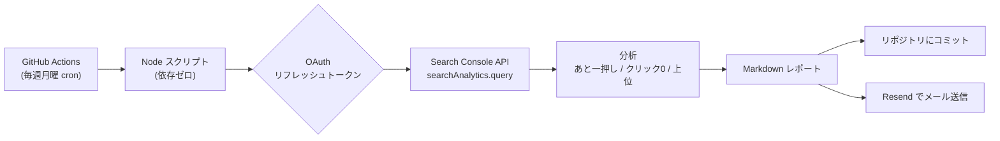
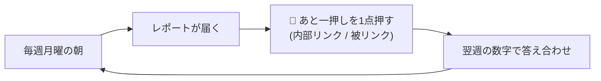

---
# Zenn用フロントマター（Qiitaで使う場合はこのブロックごと削除して本文だけ貼り付け）
title: "Search ConsoleのSEOレポートを、GitHub Actionsで毎週自動メール配信する（依存ゼロ）"
emoji: "📈"
type: "tech"
topics: ["googlesearchconsole", "githubactions", "seo", "oauth", "nodejs"]
published: false
---

> 個人サイトのSEOを「毎週GSCを開いて眺める」のが続かなかったので、**毎週月曜の朝に“今どこを押すべきか”がメールで届く**仕組みを作りました。サーバー不要・追加依存ゼロ・OAuthでサービスアカウントキーも不要、という構成です。同じところで詰まる人向けに、ハマりどころ込みで残します。

## TL;DR

- **Search Console API** から直近28日のデータを取り、**「あと一押し（順位8〜20位）」「クリック0の語」**などを抽出してMarkdownレポート化
- **GitHub Actions（cron）で毎週自動実行** → レポートをリポジトリにコミット＋**Resendでメール送信**
- 認証は**サービスアカウントキーではなくOAuthリフレッシュトークン**（組織ポリシーでSAキー作成が禁止でも動く）
- スクリプトは **Node標準APIだけ（依存ゼロ）**。`fetch` と `crypto` で完結

## なぜ作ったか

新規サイトのSEOは「数字を見ても何を直せばいいか分からない」になりがちです。特に効くのは**順位8〜20位（＝2ページ目／1ページ目の一歩手前）**の語で、ここに内部リンクや被リンクを当てると最短でクリックが増えます。これを毎週手で探すのは続かないので自動化しました。

## 全体構成



## ハマりどころ（先に共有）

| つまずき | 症状 | 解決 |
| --- | --- | --- |
| サービスアカウントキーが作れない | 組織ポリシー `iam.disableServiceAccountKeyCreation` | **OAuth方式**に切替（Desktopクライアント＋リフレッシュトークン） |
| トークンが7日で失効 | 週次が翌週から動かない | OAuth同意画面を**「本番環境」に公開**（テスト中はExternalで7日失効） |
| API が 403 | `User does not have sufficient permission for site` | プロパティが**ドメイン型**なら `sc-domain:example.com` を使う（`https://...`ではない） |
| ブラウザ表示が文字化け | ログインヘルパーの完了画面が化ける | レスポンスに `Content-Type: text/html; charset=utf-8` を付ける（動作には無害） |

## 1. OAuthでアクセストークンを取る（依存ゼロ）

サービスアカウントキーが使えないので、**ユーザーOAuthのリフレッシュトークン**で回します。`googleapis` などを入れず、`crypto` と `fetch` だけ。

```js
// リフレッシュトークン → アクセストークン（Node標準のみ）
const TOKEN_URL = 'https://oauth2.googleapis.com/token';
async function getAccessToken() {
  const res = await fetch(TOKEN_URL, {
    method: 'POST',
    headers: { 'Content-Type': 'application/x-www-form-urlencoded' },
    body: new URLSearchParams({
      client_id: process.env.GSC_OAUTH_CLIENT_ID,
      client_secret: process.env.GSC_OAUTH_CLIENT_SECRET,
      refresh_token: process.env.GSC_OAUTH_REFRESH_TOKEN,
      grant_type: 'refresh_token',
    }),
  });
  const json = await res.json();
  if (!json.access_token) throw new Error(`token error: ${JSON.stringify(json)}`);
  return json.access_token;
}
```

> リフレッシュトークンは、Desktop型OAuthクライアントを作り、`access_type=offline&prompt=consent` で一度だけ同意フローを回して取得します（ローカルに `http://localhost:PORT` の小さいサーバを立てて受け取るだけ）。

## 2. Search Console API を叩く

```js
async function query(token, siteUrl, body) {
  const url =
    `https://searchconsole.googleapis.com/webmasters/v3/sites/` +
    `${encodeURIComponent(siteUrl)}/searchAnalytics/query`;
  const res = await fetch(url, {
    method: 'POST',
    headers: { Authorization: `Bearer ${token}`, 'Content-Type': 'application/json' },
    body: JSON.stringify(body),
  });
  const json = await res.json();
  if (json.error) throw new Error(json.error.message);
  return json.rows || [];
}

// 例: 直近28日をクエリ別・ページ別で取得（GSCは2〜3日遅延するので終端は-3日）
const range = { startDate, endDate };
const byQuery = await query(token, SITE_URL, { ...range, dimensions: ['query'], rowLimit: 250 });
const byPage  = await query(token, SITE_URL, { ...range, dimensions: ['page'],  rowLimit: 100 });
```

> ⚠️ プロパティがドメイン型なら `SITE_URL = "sc-domain:example.com"`。URLプレフィックス型なら末尾スラッシュ込みのURL。

## 3. 「あと一押し」を抽出する

順位8〜20位（＝もう少しで1ページ目）を、クエリ単位とページ単位の両方で拾います。

```js
const striking = byQuery
  .filter((r) => r.position >= 8 && r.position <= 20 && r.impressions >= 1)
  .sort((a, b) => b.impressions - a.impressions);

const pageStriking = byPage
  .filter((r) => r.position >= 8 && r.position <= 20 && r.impressions >= 1)
  .sort((a, b) => b.impressions - a.impressions);
```

レポートに出すセクションはこんな構成です：

| セクション | 中身 | 使い方 |
| --- | --- | --- |
| サマリ | クリック / 表示 / CTR / 平均順位 | 先週比の健康診断 |
| 🎯 あと一押し（クエリ/ページ） | 順位8〜20位 × 表示あり | 内部リンク・被リンクを集中 |
| 👀 クリック0 | 表示はあるがCTR 0 | title/descriptionの改善余地 |
| 上位クエリ/ページ | 表示順 | 効いている方向を確認 |

## 4. GitHub Actions で毎週自動化

```yaml
name: GSC Weekly SEO Report
on:
  schedule:
    - cron: '0 0 * * 1'   # 毎週月曜 00:00 UTC（= 09:00 JST）
  workflow_dispatch: {}
permissions:
  contents: write
jobs:
  report:
    runs-on: ubuntu-latest
    steps:
      - uses: actions/checkout@v4
      - uses: actions/setup-node@v4
        with: { node-version: 22 }
      - name: Run GSC weekly report
        env:
          GSC_OAUTH_CLIENT_ID: ${{ secrets.GSC_OAUTH_CLIENT_ID }}
          GSC_OAUTH_CLIENT_SECRET: ${{ secrets.GSC_OAUTH_CLIENT_SECRET }}
          GSC_OAUTH_REFRESH_TOKEN: ${{ secrets.GSC_OAUTH_REFRESH_TOKEN }}
          RESEND_API_KEY: ${{ secrets.RESEND_API_KEY }}
          GSC_REPORT_EMAIL: ${{ secrets.GSC_REPORT_EMAIL }}
        run: node scripts/gsc-weekly-report.mjs
      - name: Commit report
        run: |
          git config user.name "github-actions[bot]"
          git config user.email "github-actions[bot]@users.noreply.github.com"
          git add docs/seo-reports/
          git diff --staged --quiet || git commit -m "chore: GSC週次レポート $(date -u +%Y-%m-%d)"
          git push
```

> `schedule` はデフォルトブランチでのみ走ります。フィーチャーブランチに置くと定期実行されない点に注意。

## 5. メールで届ける（Resend）

ファイルだけだと結局見ないので、メールも飛ばします。すでに使っているResendをそのまま利用。

```js
async function sendEmail(markdown, subject) {
  await fetch('https://api.resend.com/emails', {
    method: 'POST',
    headers: { Authorization: `Bearer ${process.env.RESEND_API_KEY}`, 'Content-Type': 'application/json' },
    body: JSON.stringify({
      from: 'GSC Report <onboarding@resend.dev>', // 自分宛なら独自ドメイン認証なしでも届く
      to: process.env.GSC_REPORT_EMAIL,
      subject,
      text: markdown,
    }),
  });
}
```

## でき上がり



毎週月曜に、受信トレイへ「今週やるべき1点」が届く状態になりました。**分析は自動・実行は人**という割り切りで、AIに記事を量産させて評価を落とすような事故も避けています。

## まとめ

- SAキーが使えない環境でも **OAuthリフレッシュトークン**で回せる
- **依存ゼロ**（`fetch` + `crypto`）でGitHub Actionsに乗せやすい
- **ドメインプロパティは `sc-domain:`**、**OAuthは本番公開でトークン失効回避**、がハマりポイント
- 「順位8〜20位」を毎週拾うだけで、新規サイトの最初の一歩がだいぶ楽になる

この仕組みは、自分で運用している [値上げナビ](https://neage-navi.com) と [Filewisp（画像・PDF変換ツール）](https://ai-image-tools.com) のSEO改善のために作りました。同じように「GSCを見ても何をすればいいか分からない」人の役に立てば嬉しいです。

<!-- 投稿時：必要なら冒頭のZennフロントマターを外し、リンク先を自分のサイトに調整 -->
